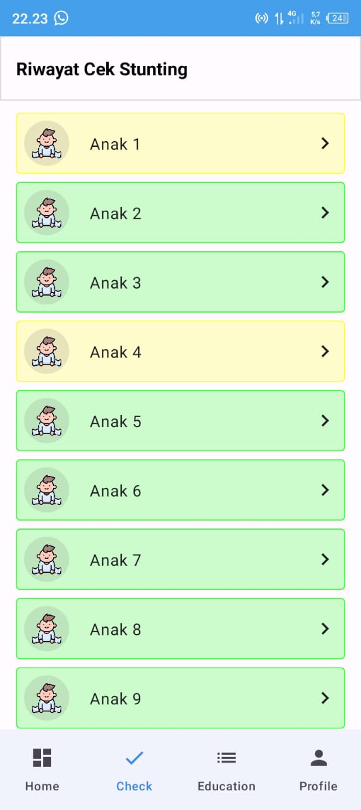

# StuntCare Made by Jetpack Compose

# About 
- Stunting-Detection-App-StuntCare
- StuntCare : Application for detecting the stunting by characteristics

## Technologies ##
Project is created with:
*  Android Studio
*  Android Jetpack Compose
*  Kotlin

# Design UI Preview

<table>
<tr>
      <td></td>
      <td></td>
      <td></td>
   </tr>
   <tr>
      <td></td>
      <td></td>
      <td></td>
   </tr> 
    <tr>
      <td></td>
      <td></td>
      <td></td>
   </tr> 
 <tr>
      <td></td>
      <td></td>
      <td></td>
   </tr> 
</table>

# Note
Download Link : [StuntCare](https://drive.google.com/file/d/1HThuwJIXwt2U7XHFCPGsP8Sj_qgDUxQz/view?usp=sharing)
